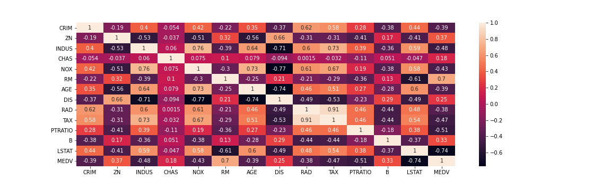
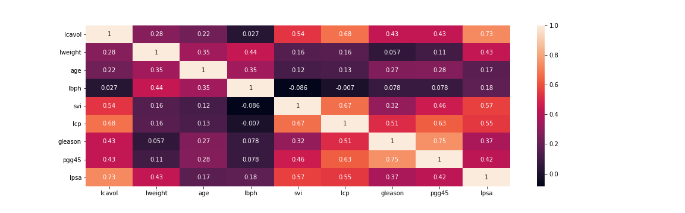
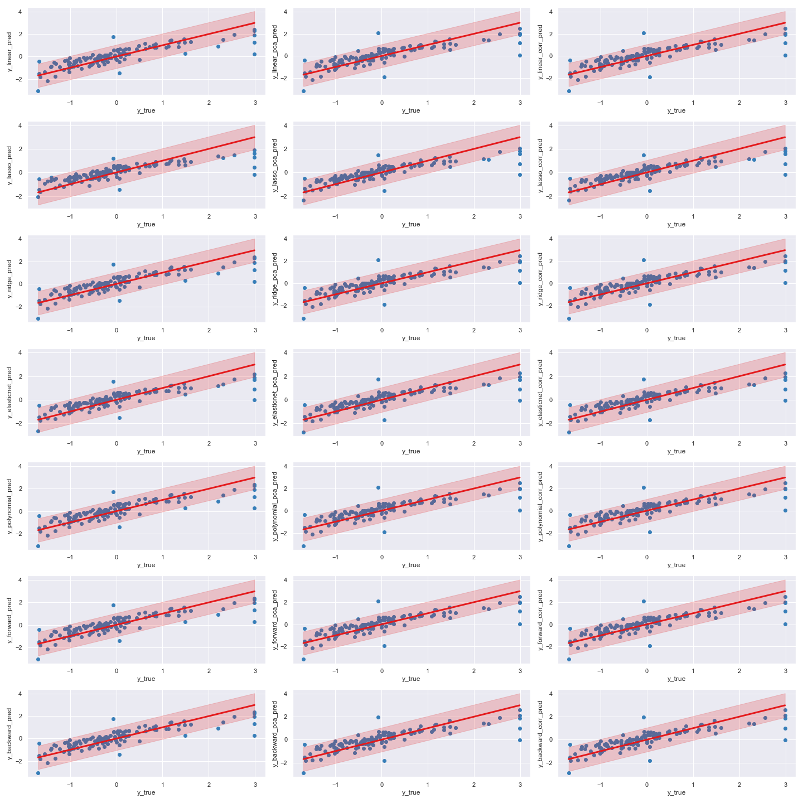
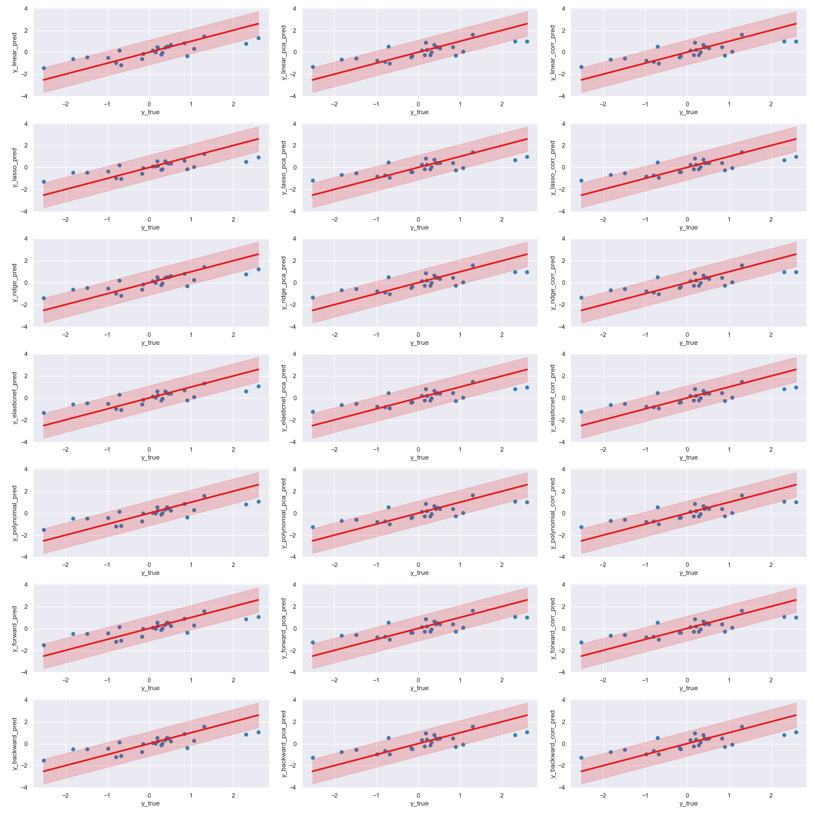

# Linear regression pipeline


## Authors

- Robin Courant ([robin.courant@imt-atlantique.net](robin.courant@imt-atlantique.net))
- Antoine Lerosey ([antoine.lerosey@imt-atlantique.net](antoine.lerosey@imt-atlantique.net))
- Victor Nepveu ([victor.nepveu@imt-atlantique.net](victor.nepveu@imt-atlantique.net))
- Moad Yakoubi ([moad.yakoubi@imt-atlantique.net](moad.yakoubi@imt-atlantique.net))


## Table of Contents

1. [Requirements and Installation](#requirements_installation)
1. [Usage](#usage)
1. [Good programming practices](#programming_practices)
   1. [Git and Github](#github)
   1. [Python](#python)
1. [Datasets](#datasets)
   1. [Boston Housing](#boston_housing)
   1. [Prostate Cancer](#prostate_cancer)
1. [Feature Selection](#feature_selection)
   1. [Principal Component Analysis - PCA](#PCA)
   1. [Correlation](#correlation)
1. [Regression Models](#models)
   1. [Linear Regression](#linear)
   1. [Lasso Regression](#lasso)
   1. [Ridge Regression](#ridge)
   1. [Elastic-Net Regression](#elasticnet)
   1. [Step-wise Forward Regression](#forward)
   1. [Step-wise Backward Regression](#backward)
   1. [Polynomial Regression](#polynomial)
1. [Result Analysis](#Result)
   1. [Linear Regression](#linear)
   1. [Ridge, Lasso & ElasticNet Regression](#penalizer)
   1. [Step-wise Forward and Backward Regression](#forward_backward)
   1. [Polynomial Regression](#polynomial)
1. [References](#references)
1. [Appendix](#appendix)

---

## 1. Requirements and Installation <a name="requirements_installation"></a>

- python 3.8
- pip version >= 20.0

```
pip install -r requirements.txt
```

## 2. Usage <a name="usage"></a>

In the shell, do not forget to add the path to the repository to your `$PYTHONPATH` variable, by running:
```
export PYTHONPATH="path_to_repo/regression_pipeline/"
```


In the the root of the repository, run the following command:
```
python ./pipeline_regression/main.py ./datasets/filename.csv model_name -f feature_selection -n n_splits
```

If `feature_selection` argument is not provided, no preprocessing will be done.
If `n_splits` argument is not provided, there will be 2 cross-validation steps.

For more details, run:
```
python ./pipeline_regression/main.py -h
```
## 3. Good programming practices :<a name="programming_practices"></a>

These practice, even though they might seem demanding and maybe rigid, are guidelines that should be enforced. It is not because these
were our guidelines that each one of them is respected at all times. For instance, while getting familiar with the *git* tool, one might
rather focus on actually understanding the workflow rather than the conventions surrounding it.

The fact that this project is a small scale student project with no users makes it so that the programming practices, if they are not enforced
perfectly, are not going to have much of an effect on the project itself. It is however a good habit to take, because on large projects
with a vast codebase, not respecting conventions and good practices can have a devastating effect, in terms of time lost especially.

### 3.1 Git and Github : <a name="github"></a>

Any self-respecting project should use a *Version Control System* (*VCS*). Git being the most popular, it is generally thought of as the only
correct option.

An introduction to *git* can be found [here](https://git-scm.com/video/what-is-version-control).

The following sections will assume at least basic knowledge of the *git* workflow and keywords.

#### Commit messages :
- A commit message has two parts, a title and a details section.

- When writing either part, it should be remembered that the commit messages won't be read only by the committing
developer, but by all of the project's contributors. Even if the developer is working alone, writing a commit that even
someone from outside the project could somewhat understand is essential, because things that might seem self-evident at the time of
writing (e.g. "fix that really annoying bug") will be completely obscure a few month down the road.

- The commit title should be < 50 char, and should strive to complete the sentence "this commit will …".
It is brief, informative, and should summarize the changes in an imperative voice.

- The commit details can be more verbose, but should rather focus on *why* the changes were made, not the changes
themselves, because those can be found with a simple `git show`. It is there to justify design choices.

#### Git workflow :

- It is better to do *atomic commits*, that is, commits that change only *one thing at a time*, ie for instance fix only one bug.
Changing multiple features at once is discouraged, because it breaks the ability to reverse changes and find the commits introducing a bug.
The other extreme should be avoided too, i.e. don't make one commit for each typo fixed.

- When working on a new feature, make sure to work in a new branch by doing `git checkout -b feature-name`. It is generally thought better
to use the `-` character while naming branches. Branche names should be short and easy to refer to, e.g. `fix-login-ui` or `result-analysis`.

- Don't push to the remote repository, even when working on a branch, until all changes have been reviewed and integrated by the developer.
It allows the developer to rewrite his local history with `git rebase -i`, so that many commits can be squashed together, typos can be fixed
without having multiple commits for it, and so on.

#### Github workflow :

- Even if all developer have a write access to *master*, and can therefore push their commits on it, it is discouraged to push commits
directly to master. It is better to merge changes through a *pull request*, which can be done via the Github interface or even Github CLI tool.

- The pull request should originate from the branch the developer is working on. It should explain why the commits in the pull request are
necessary and what issues they address or bug they fix.

- The developper opening a pull request should request a review from fellow developers. This way errors can be averted prior to merging the
pull request into master, as a new perspective on the code often perceives errors that would be invisible to the developer.

- Discussions on the code should occur inside the pull request as much as possible, as these discussion are a good way to understand design
choices later.

### 3.2 Python : <a name="python"></a>

We strived to enforce the [PEP 8](https://www.python.org/dev/peps/pep-0008/) convention.
The PEP are proposals made in the Python ecosystem that are often considered as strongly recommended guidelines
for the way Python code is written.
It covers everything from the way variable names should be chosen to the number of empty lines between two functions.
This convention is often automatically enforced by modern code editors, and tools such as [pylint](https://www.pylint.org/)
can help the developer.


## 4. Datasets <a name="datasets"></a>

An exploration data analysis is available in the directory: [./data_analysis/eda](./data_analysis/eda).

### 4.1 Boston Housing <a name="boston_housing"></a>

There are 13 features to predict the price houses in Boston (`MEDV` feature).

Description:
  - `CRIM`: per capita crime rate by town.
  - `ZN`: proportion of residential land zoned for lots over 25,000 square feet.
  - `INDUS`: proportion of non-retail business acres per town.
  - `CHAS`: Charles River dummy variable (1 if tract bounds river; 0 otherwise).
  - `NOX`: nitric oxides concentration (parts per 10 million).
  - `RM`: average number of rooms per dwelling.
  - `AGE`: proportion of owner-occupied units built prior to 1940.
  - `DIS`: weighted distances to five Boston employment centres.
  - `RAD`: index of accessibility to radial highways.
  - `TAX`: full-value property-tax rate per $10,000.
  - `PTRATIO`: pupil-teacher ratio by town.
  - `B`: 1000(Bk - 0.63)^2 where Bk is the proportion of African Americans by town.
  - `LSTAT`: % lower status of population.
  - `MEDV` (target): median value of owner-occupied homes in $1000's.



### 4.2 Prostate Cancer <a name="prostate_cancer"></a>

There are 8 features to predict a log of PSA (Prostate Specific Antigen) value, a marker for Prostate cancer (`lpsa` feature).

Description:
  - `lcavol`: log of cancer volume.
  - `lweight`: log of prostate weight.
  - `age`: age of subject.
  - `lbph`: log of benign prostatic hyperplasia amount.
  - `svi`: seminal vesicle invasion.
  - `lcp`: log of capsular penetration.
  - `gleason`: Gleason score.
  - `pgg45`: percentage Gleason scores 4 or 5.
  - `lpsa` (target): log of PSA.



## 5. Feature selection <a name="feature_selection"></a>

### 5.1 Principal Component Analysis - PCA <a name="PCA"></a>

Principal Component Analysis (PCA) is a dimensionality reduction technique that aims to reduce the number or features in the dataset. The technique is to combine the features in one matrix and extract the eigenvectors associated to the k highest eigenvalues in order to become the new features.

PCA when combined with linear regression is called Principal component regression (PCR) algorithm. The main issue we face with multi variate features data (data with considerable number of features) is the high variance of the model, which implies high instability of the prediction.

Consequently, the goal of reducing the dimension is to add more bias to the model, and therefore to penalize the accuracy but to guarantee less variance of the predictions.

The steps of the algorithm consist on creating the principal components from the existing features at first. Then we train the model on the components and transform the PCs back to the original features to make predictions on the actual dataset.

One of the main advantages of performing PCA before regression is to reduce the spatial and temporal complexity of the algorithm, and hence gain in performance. The second is to deal with overfitting especially on data with high colinearity.

The crucial decision to take before performing the PCA is to choose the number of output features. In our model, we choose to select the features depending on a desired level of variance to keep in our data.


### 5.2 Correlation <a name="correlation"></a>

This technique takes in parameter the number 'k' of features to keep to train the model during next step.
The `SelectKbest` function using `f_regression` as score function, compute the correlation between each of the input feature and the label column.
Only the 'k' inputs having the higher correlation factors are kept for the model training.


## 6. Regression Models <a name="models"></a>

### 6.1 Linear Regression <a name="linear"></a>

Linear Regression fits a linear model by awarding to each input a coefficient in order to minimize a cost function. In Linear Regression, the cost function is the sum of squared errors between the target and the prediction.

### 6.2 Ridge Regression <a name="ridge"></a>
Ridge Regression also fits a linear model but with an L2 penalty term being added to the cost function. This penalty term is the sum of the squared of the coefficient multiplied by a constant (Lagrange multiplier).

Ridge regression is a regularized regression, the penalty term being also called a regularization term.

### 6.3 Lasso Regression <a name="lasso"></a>

Lasso Regression also fits a linear model but with an L1 penalty term being added to the cost function. This penalty term is the sum of the absolute value of the coefficient multiplied by a constant (Lagrange multiplier)

Lasso regression is also a regularized regression.

### 6.4 Elastic-net Regression <a name="elasticnet"></a>

Elastic-net Regression is a linear regression that combines both L1 and L2 regularization. In fact, the cost function of the Elastic-net model has two penalty terms : one L1 and one L2.

### 6.5 Step-wise Forward Regression <a name="forward"></a>

Step-wise regression is a training and fit method consisting on choosing features and model inputs in an automatic procedure. The procedure of feature selection is done by adding on eliminating initial features via a statistic t-test criterion.
Forward regression approach starts with an empty set of features, and for each iteration of the feature selection we add the variable whose inclusion gives the most statistical significance in terms of the fit. We repeat the procedure until there is no feature that has an acceptable statistical significance on the model.
After the selection procedure, a linear regression is processed on the newly created features.

### 6.6 Step-wise Backward Regression <a name="backward"></a>

Backward regression is, with forward regression, another form of step-wise regression. While the forward starts with an empty dataset, the backward regression starts with all the features and eliminate at each iteration the inputs with the lest significance based on the t-test. We repeat the procedure until there is no features that can be removed by the statistical test and we proceed to a linear regression on the new features.

### 6.7 Polynomial Regression <a name="polynomial"></a>

Polynomial regression is a regression analysis in which the relationship between input and output variables is modelled as an nth polynomial degree in the inputs. This approach is quite helpful in the case where a linear relationship assumption on the model does not hold.

## 7. Result Analysis <a name="results"></a>

A result analysis is available in the directory: [./data_analysis/results_analysis](./data_analysis/results_analysis). <br/>
Correlation plots are available in the [Appendix](#appendix) section.


### 7.1 Linear Regression <a name="Linear"></a>
Linear regression gives good result with the `prostate_cancer` dataset but not so good result with the `boston_hounsing` dataset.
We notice that with the `prostate_cancer` dataset, linear regression gives better result when it is us without feature selection, while for the `boston_housing` dataset, a feature selection help to improve the score (we consider MSE as the score here). This means that in the `prostate_cancer` dataset, the variance is more distributed on the different features while in the `boston_housing` data set, some features retain the major part of the variance.

### 7.2 Ridge, Lasso & ElasticNet Regression <a name="penalizer"></a>

Ridge, Lasso and ElasticNet regression models works on the same principles.
They all Linear regression model with regularization terms. Ridge regression has an L2 regularization term, Lasso regression has an L1 regularization term and Elastic-net has both L1 and L2 regularization terms linked to each other by a proportionnal factor.
Hence we can analyze the results of this three models together.
The first thing that we notice is that for both dataset, Lasso regression is always the less efficient of these three models.
What's more, Ridge regression is in both case more efficient than ElasticNet regression. Hence we can conclude that the regularization with an L1 term doesn't help to fit these two datasets.

### 7.3 Step-wise Forward and Backward Regression <a name="forward_backward"></a>

Forward and backward regression algorithms can be compared to a principal components analysis in terms of dimensionality reduction. However, the difference between the both is that PCA takes the variables that contains most of the features variance and thus information, whereas forward and backward selects variables with the best statistical information significance and data explanation.
For Boston housing dataset example, forward regression selects 11 features for a p-value of 0.05 and backward regression selects 11 features too for a p-value of 0.01. We can notice and both algorithms drop AGE & INDUS features. This can be interpreted as the customers are not sensitive to weather the zone has old occupied buildings or if there is more or less industrial acres in the town.
For both datasets, stepwise regression has always one of the best scores in terms of bias and variance, i.e MSE and r2. Nevertheless, one of the criticism that can be addressed to the stepwise algorithm is that it can be slower in terms of computation on huge datasets. This is because of the consuming procedure of selection that goes through all the features at each selection iteration.

### 7.4 Polynomial Regression <a name="polynomial"></a>

Linear regression is the most widely used approach when it comes to a linear relationship between the dependant variables (features) and independent variables (labels). However, in the case of non linear structures, a straight line doesn't capture most of data information and thus omits patterns in the data.
The analysis of Boston housing dataset shows that the relationship for example between LSTAT & RM with the label has a second degree polynomial behaviour. Consequently, using polynomial features in our model will allow to have less bias (i.e lower mean squared error) and therefore less underfitting. We should note that the polynomial degree of the features has to be chosen carefully in order to avoid high variance and overfitting in our model.
For all of these reasons, polynomial regression error score are pretty better than linear regression. However, introducing nth power degree of the feature impacts the stability of the model and results in have a quite better r2 score for linear regression.
For prostate cancer dataset, the data exploration shows that there is less polynomial property in the relationship between `lpsa` (target) and the inputs. Hence, linear regression performs better than polynomial.

___

## References <a name="references"></a>

**PCA**
- [https://en.wikipedia.org/wiki/Principal_component_regression](https://en.wikipedia.org/wiki/Principal_component_regression)
- [https://iq.opengenus.org/principal-component-regression/](https://iq.opengenus.org/principal-component-regression/)

**Polynomial regression**
- [https://towardsdatascience.com/polynomial-regression-bbe8b9d97491](https://towardsdatascience.com/polynomial-regression-bbe8b9d97491)

**Step-wise regression**
- [https://en.wikipedia.org/wiki/Stepwise_regression](https://en.wikipedia.org/wiki/Stepwise_regression)

**Prostate Cancer**
- [https://web.stanford.edu/~hastie/ElemStatLearn/datasets/prostate.data](https://web.stanford.edu/~hastie/ElemStatLearn/datasets/prostate.data)

**Boston Housing**
- [https://www.kaggle.com/altavish/boston-housing-dataset](https://www.kaggle.com/altavish/boston-housing-dataset)


## Appendix <a name="appendix"></a>




